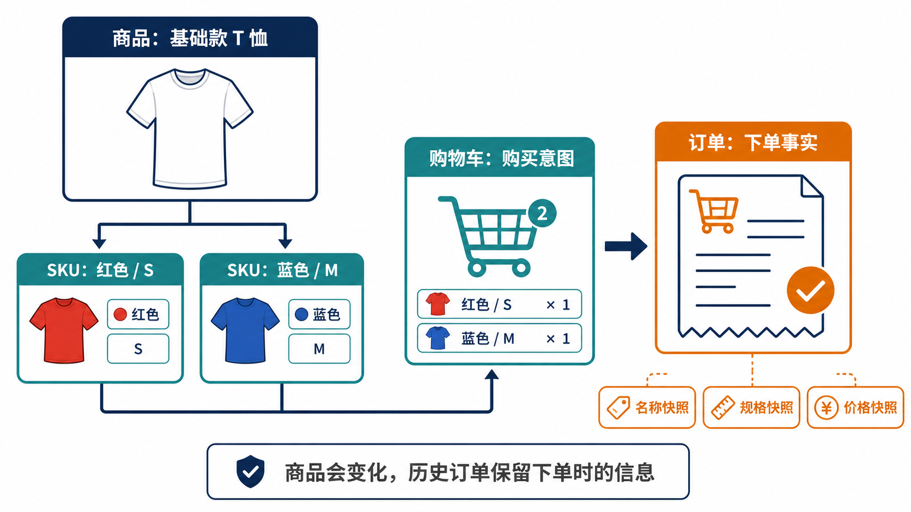
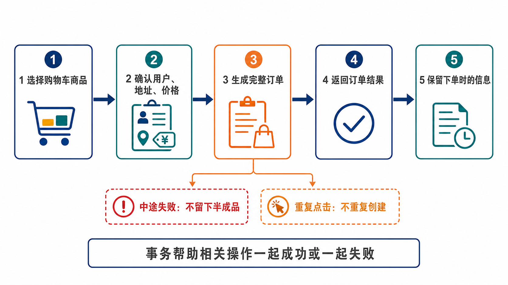

# learn-backend 第三轮考核：电商业务与下单闭环

> 本轮在第二轮用户域的基础上，引入商品域和交易域，完成“用户登录 → 浏览商品与 SKU → 加入购物车 → 提交订单”的下单链路。

本轮只包含 **用户、商品、交易** 三个业务域。支付、活动、独立库存、仓库、履约等领域全部后移。

需要特别说明：本轮完成的是“下单闭环”，不是包含支付、发货和售后的完整电商交易闭环。订单创建成功后只代表系统接受了用户的购买请求，不能伪造“已支付”或“已发货”等业务事实。

本轮继续支持 **Java** 和 **Go** 两条技术路线，并在第二轮项目上持续迭代，不重新创建无关项目。

## 参考资料与 AI 学习方式

本轮继续使用“AI 辅助教学 + 官方文档核验”的学习方式。AI 不能保证信息正确或及时；涉及框架版本、数据库行为、金额计算和事务时，必须要求 AI 标注版本、官方来源和待验证内容。

提问前请说明：

- 使用 Java 还是 Go；
- 语言、Web 框架、数据库和数据访问框架版本；
- 第二轮用户域采用的认证方案；
- 当前正在开发商品、购物车还是订单；
- 希望获得原理讲解、设计评审、递进练习还是错误排查。

不要让 AI 一次性生成整个电商项目。先完成业务规则和数据模型，再分模块实现和测试。

以下提示词基于公开的教学与评审模板改造；各文件末尾记录了模板来源和本轮适配说明。使用前先补全环境信息。Go 技术栈暂由协作同学补充，当前模板不会替其选择框架或数据访问方案。

- [提示词一：生成第三轮学习路线](prompts/round3/prompt1.md)
- [提示词二：理解商品、SKU 与价格](prompts/round3/prompt2.md)
- [提示词三：理解购物车、订单与快照](prompts/round3/prompt3.md)
- [提示词四：理解事务与重复提交](prompts/round3/prompt4.md)
- [提示词五：评审我的业务设计](prompts/round3/prompt5.md)

## 本轮会学到什么

- 用户如何管理自己的收货地址，并在下单时使用它；
- 类目、商品和 SKU 分别表示什么；
- 管理员如何维护商品，用户如何浏览和选择商品；
- 购物车和订单有什么不同；
- 系统如何确认价格、生成订单并保留下单时的信息；
- 商品改名、改价或下架后，购物车和历史订单应该如何表现；
- 用户重复提交或下单中途出错时，系统为什么不能产生混乱数据；
- 如何通过测试证明一条下单流程确实可用。

### Java 路线

- Spring Boot、Spring MVC；
- Spring 事务管理；
- MyBatis/MyBatis-Plus 或 Spring Data JPA/Hibernate；
- Spring Security、Sa-Token 等方案中当前用户身份的传递。

### Go 路线

- `net/http`、Gin 或其他成熟 Web 框架；
- `database/sql`、sqlx、GORM 或 Ent 的事务处理；
- Context 中当前用户身份的传递；
- Go 的表驱动测试与接口测试。

## 功能范围

本轮只完成以下三个部分：

```text
用户域
  提供当前用户身份和收货地址
       ↓
商品域
  提供商品、SKU、价格和可售状态
       ↓
交易域
  管理购物车、订单和订单明细
```

可以先把它理解为三个各自负责一类事情的模块：

- 用户域拥有用户资料和收货地址；
- 商品域拥有类目、商品、SKU、价格和上下架状态；
- 交易域拥有购物车、订单和订单明细；
- 下单时需要使用当前登录用户的身份和地址；
- 下单时需要向商品模块确认 SKU、价格和是否可售；
- 购物车和订单不能反过来改变用户资料或商品信息。

本轮仍然做一个可以独立运行的后端项目，不要求拆成微服务。实现过程中需要逐步理解模块为什么要分开，具体代码组织方式可结合提示词和所选框架学习。

## 任务

本轮分为三个阶段。请按顺序完成，每完成一阶段保存一次清晰的 Git 记录。

### 第一阶段：完善用户域

继续使用第二轮完成的注册、登录和身份认证，不重新实现一套用户系统。

本轮补充交易所需的用户功能：

- 管理自己的收货地址；
- 设置默认收货地址；
- 下单时选择自己的收货地址；
- 只能查看和操作自己的地址、购物车和订单。

收货地址属于用户域；订单中保存的是下单时使用的地址快照，两者不能混为同一条可变记录。

### 第二阶段：商品域

#### 商品管理与浏览

一个商品可以拥有多个 SKU。SKU 表示可以被选择、加入购物车和下单的具体规格。



图中的商品负责共同展示信息，SKU 表示颜色、尺码等具体选择。用户把 SKU 加入购物车；订单生成后，会保留下单时的名称、规格和价格。

完成以下功能：

- 管理员管理类目、商品和 SKU；
- 管理员可以上架、下架商品或 SKU，并修改 SKU 价格；
- 用户可以分页浏览已上架商品并查看可选 SKU；
- 已下架的商品或 SKU 不能继续被正常购买。

本轮不建立独立库存域。可以使用“是否可售”或简单数量字段辅助测试，但不要求库存锁定、扣减、释放、防超卖、多仓或库存流水。

实现功能时需要逐步理解并记录：

- 商品和 SKU 为什么分开；
- 哪些字段属于商品，哪些字段属于 SKU；
- 商品、SKU 被下架或停用后，购物车和历史订单分别如何处理；
- 为什么历史订单不能每次展示时重新读取当前商品名称和价格。

### 第三阶段：购物车与下单

#### 购物车

完成以下功能：

- 将可购买的 SKU 加入购物车；
- 查看购物车，修改数量或删除商品；
- 选择部分或全部购物车商品下单；
- 商品不可购买时给出明确提示。

购物车只保存用户当前的购买意图。购物车中展示的价格是查询时价格，不是最终成交价格。

#### 创建订单

用户提交订单后，系统需要确认登录用户、收货地址、所选商品、购买数量和当前价格，再生成订单。订单应显示本次购买了什么、每项数量和价格、总金额以及收货信息。



图中的五步是一条完整流程。任何一步出错都不能留下半成品；同一次提交被重复发送，也不能反复生成新订单。

客户端可以告诉系统“想买什么”，但不能替系统决定购买用户、成交价格、订单总额或订单状态。请先借助[购物车、订单与快照提示词](prompts/round3/prompt3.md)理解原因，再实现这条流程。

#### 订单与订单明细

订单需要记录订单编号、下单用户、下单时间、收货信息、订单状态和总金额；订单中的每件商品需要记录具体 SKU、名称、规格、成交价格和数量。

商品改名、改价或用户修改地址后，已经生成的订单仍应展示下单当时的信息。金额如何保存和计算，需要结合所选语言与数据库的官方资料学习，不能直接使用会产生不可控误差的类型。

#### 取消和查询订单

用户可以查看自己的订单列表和订单详情，也可以取消仍允许取消的订单。本轮只需要简单状态，例如：

```text
CREATED → CANCELLED
```

不能添加尚未真正发生的 `PAID`、`SHIPPED`、`DELIVERED` 等状态；取消订单也不涉及退款、库存返还或物流处理。

#### 下单失败和重复点击

需要处理两种用户能直接遇到的问题：

- 下单过程出错时，不能出现“订单存在但商品不完整”等半成品；
- 用户重复点击提交时，不能产生多笔无法解释的相同订单。

先使用[事务与重复提交提示词](prompts/round3/prompt4.md)学习“什么是事务、为什么下单需要事务、重复请求为什么会产生问题”，再结合当前框架实现并测试。考核关注最终行为和你的解释，不限定必须照搬某一种技术方案。

## 验收标准

以下用户可观察的结果是本轮验收重点：

1. 管理员可以维护类目、商品、SKU、价格和上下架状态；
2. 用户可以浏览商品、管理自己的地址和购物车，并完成下单；
3. 用户不能查看或修改其他用户的地址、购物车和订单；
4. 下架商品不能继续购买，购物车会给出明确反馈；
5. 订单价格由服务端确认，客户端伪造价格或用户身份无效；
6. 商品、价格或地址后续变化不会改变历史订单；
7. 下单中途失败不会留下半成品订单；
8. 重复提交不会产生无法解释的重复订单；
9. 用户可以查看和取消自己的订单；
10. 系统不会显示尚未发生的支付、发货或签收状态。

## 项目要求

- 使用 Java 或 Go，在第二轮项目上继续开发；
- 项目能够从零完成数据库初始化并正常启动；
- 用户、商品和交易代码分区清楚；
- 不提交密码、密钥或真实用户数据；
- 提供 API 文档、主要业务图、自动化测试和项目 README。

## 测试要求

至少验证以下场景：

- 管理员创建类目、商品和多个 SKU；
- 普通用户浏览已上架商品；
- 普通用户不能执行商品管理操作；
- 商品或 SKU 下架后不能正常加入购物车或提交订单；
- 用户只能操作自己的购物车、地址和订单；
- 创建订单时服务端忽略客户端伪造的价格和 userId；
- 商品改价或用户修改地址后，历史订单快照不变；
- 创建订单中途失败时不会留下半成品；
- 重复提交同一请求时不会产生无法解释的重复订单；
- 用户能够查看并正确取消自己的订单。

测试数量不是评分重点，主要功能、权限和出错后的结果是否得到验证才是。

## 提交内容

- 完整源代码和依赖声明；
- 数据库初始化或升级脚本；
- 自动化测试及运行方式；
- API 文档和主要业务图；
- 项目 README；
- 能体现三个阶段进展的 Git 记录。

README 至少说明如何启动和测试项目、主要功能如何使用、三个模块分别负责什么，以及未完成内容和已知问题。商品与 SKU、购物车与订单、历史订单信息、下单失败和重复点击等设计理由可以结合提示词整理后写入。

## Bonus

完成必做内容后，可以选择以下方向：

1. 为商品列表增加组合筛选、排序和稳定分页；
2. 为订单编号设计可解释且可测试的生成方案；
3. 增加简单商品可售数量，但不拆分独立库存域；
4. 进一步完善重复下单记录与清理机制；
5. 增加管理员订单查询和审计记录；
6. 将应用与 MySQL 一起容器化，并提供一键启动方式；
7. 自动生成并维护可交互 API 文档。

Bonus 不能替代商品浏览、购物车、下单、历史订单和权限等必做功能。

## 提示

- 第三轮先把用户、商品和交易三个域做正确，不要提前加入支付和履约；
- 商品是展示和归类概念，SKU 才是用户实际选择和下单的对象；
- 购物车价格只是当前展示，创建订单时必须重新查询并由服务端计价；
- 订单快照用于保存交易发生时的事实，不能被当前商品和地址数据覆盖；
- 金额、事务和重复请求的具体实现依赖语言、框架和数据库版本，先理解问题，再核对官方文档；
- 事务用于让一组相关操作一起成功或一起失败；它不能自动解决所有重复请求问题；
- 不要为了“解耦”提前拆成微服务，模块边界清晰优先；
- AI 适合解释、评审和排错，不能替代业务规则与测试；
- README 中应如实记录未完成内容和已知问题。
