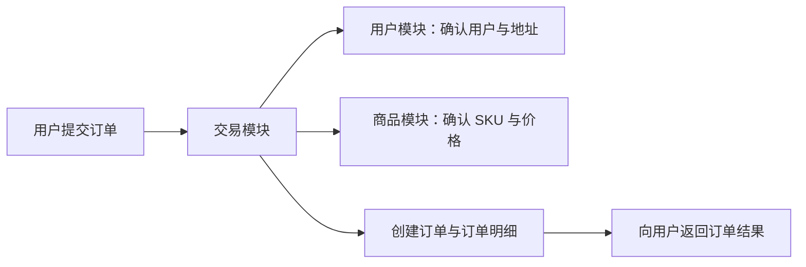
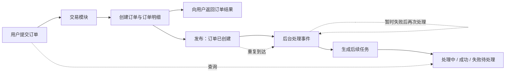

# learn-backend 第四轮考核：模块化与异步协作

> 本轮继续迭代第三轮电商项目。你将整理现有模块，并完成一条“订单创建后生成后续任务”的异步功能链路。

## 时间与内容量

本轮安排 6 周，建议每周投入 10～15 小时。必做内容集中在两个目标：整理模块边界、完成一条可靠的异步链路。缓存、服务拆分和完整监控体系放到后续轮次或 Bonus。

建议节奏：

- 第 1 周：回顾第三轮项目，画出现有模块和调用关系；
- 第 2 周：整理用户、商品和交易模块；
- 第 3～4 周：完成事件发布、后台处理和结果查询；
- 第 5 周：处理重复消息、暂时失败和最终失败；
- 第 6 周：补充测试、文档和演示。

## 参考资料与 AI 学习方式

本轮继续采用“AI 辅助教学 + 官方文档核验”。先理解同步处理、异步处理、业务事件、消息重复和失败重试，再选择当前语言对应的实现方式。

- [提示词一：生成第四轮学习路线](prompts/round4/prompt1.md)
- [提示词二：梳理模块边界](prompts/round4/prompt2.md)
- [提示词三：理解同步、异步与业务事件](prompts/round4/prompt3.md)
- [提示词四：理解重复消息、重试与失败记录](prompts/round4/prompt4.md)
- [提示词五：评审第四轮实现](prompts/round4/prompt5.md)

## 知识点总结

- **业务模块**：按照用户、商品、交易等业务能力组织代码。每个模块集中维护自己的功能和数据，让职责、修改范围和调用关系更容易理解。
- **模块协作**：一个模块通过公开功能使用另一个模块提供的信息。例如，交易模块在下单时向商品模块确认 SKU 和价格。
- **同步处理**：用户发起请求后等待系统完成处理并返回结果。创建订单等需要立即确认结果的步骤适合同步完成。
- **异步处理**：请求先返回，后台继续完成后续工作。订单通知、后续任务等允许稍后完成的功能可以异步处理。
- **业务事件**：事件用于描述已经发生的业务事实，例如“订单已创建”。其他模块收到事件后开展自己的工作。
- **重复处理**：同一事件可能到达多次。系统需要识别同一业务动作，让多次处理保持一份有效结果。
- **失败重试**：网络波动或组件短暂不可用时，后台任务可以再次处理。重试次数和处理结果需要被记录。
- **失败记录与恢复**：持续失败的任务保存当前状态和失败原因，修复问题后可以重新处理。
- **关联日志**：订单编号、事件编号和任务编号将一次请求与后台处理连接起来，帮助定位处理进度和失败位置。

### Java 路线

- 使用 Spring Boot 继续组织用户、商品和交易模块；
- 使用 Spring 的事件机制或成熟消息组件发布和处理业务事件；
- 使用 Spring 事务管理事件发布前后的本地数据操作；
- 使用当前测试框架验证重复处理、失败重试和任务状态变化。

### Go 路线

## 项目链路变化

### 第四轮开始时

第三轮项目以同步下单为主。用户等待系统确认身份、地址、商品和价格，系统创建订单后返回结果，链路在订单创建处结束。

### 第四轮完成后

订单仍通过同步链路创建并返回结果。订单创建后发布业务事件，后台处理者生成后续任务；用户可以继续查询任务状态。

第四轮增加的是订单创建后的后台链路。同步下单结果与后台任务状态分别表达各自的处理进度。

## 功能场景

第三轮创建订单后，系统新增一项后续任务。你可以选择以下一种功能：

- 生成订单确认通知；
- 生成待处理履约任务；
- 记录订单操作日志；
- 更新一个订单统计结果。

本轮以“生成待处理履约任务”为默认示例。这里的任务只表示后续工作已经登记，实际仓库、物流和发货功能在后续轮次继续实现。

## 任务

### 第一阶段：整理现有模块

- 按用户、商品和交易功能整理现有代码；
- 为每个模块写一段简短职责说明；
- 画出创建订单时的模块调用关系；
- 保持第三轮注册、商品浏览、购物车和下单功能可用。

重点理解：为什么一个模块应通过公开功能使用另一个模块的数据，以及混合修改多个模块内部数据会带来什么问题。

### 第二阶段：增加订单后续任务

- 订单创建成功后发布一条“订单已创建”事件；
- 后台处理事件并生成一条后续任务；
- 用户可以查询订单及其后续任务状态；
- 日志可以关联订单、事件和处理结果。

先使用[同步、异步与业务事件提示词](prompts/round4/prompt3.md)理解为什么把后续工作放到后台，以及事件为什么描述已经发生的事实。

### 第三阶段：处理重复与失败

- 同一事件重复到达时保持一条有效任务；
- 暂时性失败后再次尝试处理；
- 多次失败后记录失败原因和当前状态；
- 修复问题后可以重新处理失败任务。

先使用[重复消息、重试与失败记录提示词](prompts/round4/prompt4.md)预测各种失败结果，再结合当前组件实现。

## 验收标准

1. 第三轮主要功能仍然可以运行；
2. 代码按业务模块组织，模块职责可以清楚说明；
3. 创建订单后会生成一条可查询的后续任务；
4. 用户可以看到后续任务的处理中、成功或失败状态；
5. 同一事件重复处理时保持一条有效任务；
6. 暂时失败后系统会再次处理；
7. 持续失败会留下原因，并支持重新处理；
8. 日志能够通过订单编号或事件编号找到完整处理过程。

## 项目要求

- 继续使用第三轮项目和数据库；
- 选择一种成熟的消息组件或本地任务队列；
- 项目可以完成初始化、启动和主要功能演示；
- 提供自动化测试、功能说明和项目 README；
- 配置与代码分开保存，示例配置可供验收者使用。

## 测试要求

至少验证：

- 创建订单后生成后续任务；
- 同一事件处理两次后仍只有一条有效任务；
- 第一次处理失败、再次处理成功；
- 多次失败后留下失败记录；
- 重新处理失败任务后状态正确更新；
- 原有商品、购物车和订单功能保持可用。

## 提交内容

- 完整源代码和依赖声明；
- 数据库初始化或升级脚本；
- 自动化测试及运行方式；
- 模块关系图和异步流程图；
- 事件与任务状态说明；
- 项目 README；
- 能体现三个阶段进展的 Git 记录。

## Bonus

完成必做功能后，可以选择一个方向：

1. 为商品详情增加缓存，并展示命中与回源结果；
2. 使用容器编排一键启动应用、数据库和消息组件；
3. 增加简单的处理数量、失败数量和耗时统计；
4. 将一个边界清楚的模块拆成独立服务，并记录拆分前后的变化。

## 提示

- 先用一条业务链路理解异步协作，再扩展更多事件；
- 业务事件使用“订单已创建”这类已经发生的事实命名；
- 重复消息是常见运行情况，处理结果需要保持一致；
- 重试适合暂时性失败，持续失败需要保留原因和处理入口；
- 日志中的订单编号和事件编号用于连接请求与后台处理过程；
- 组件选择服务于功能目标，考核重点是可运行、可解释和可验证。

## 官方资料入口

- [RabbitMQ Reliability Guide](https://www.rabbitmq.com/docs/reliability)
- [RabbitMQ Consumer Acknowledgements and Publisher Confirms](https://www.rabbitmq.com/docs/confirms)
- [Apache Kafka Design](https://kafka.apache.org/documentation/#design)
- [Docker Compose Quickstart](https://docs.docker.com/compose/gettingstarted/)

使用其他组件时，请补充对应版本的官方文档。
