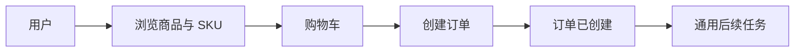
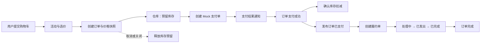

# learn-backend 第五轮考核：电商业务域补全

> 本轮继续迭代第四轮项目。你将补充活动、选价、支付、仓库基础和履约能力，把“浏览商品—加入购物车—提交订单”继续推进到“确认价格—占用库存—完成支付—进入履约—订单完成”。

## 时间与内容量

本轮安排 8 周，建议每周投入 10～15 小时，总投入约 80～120 小时。五个新增业务能力被组织成三组协作功能：活动与选价、支付、仓库与履约。每组只实现一条最小主流程，复杂促销、多仓调度、真实支付渠道、物流平台和售后退款进入第六轮拓展。

建议节奏：

- 第 1 周：画出完整交易链路，明确模块职责和业务事实；
- 第 2 周：实现一种活动规则和确定性选价；
- 第 3 周：把价格明细与订单快照连接起来；
- 第 4 周：实现本地 Mock 支付和支付结果通知；
- 第 5 周：实现仓库、SKU 库存和库存预留；
- 第 6 周：实现支付后的履约单和状态查询；
- 第 7 周：处理重复请求、取消释放和异步失败；
- 第 8 周：完成端到端测试、文档和答辩演示。

## 参考资料与 AI 学习方式

本轮继续采用“AI 辅助教学 + 官方文档核验”。先用业务事件和状态变化理解各域职责，再实现接口、数据和测试。金额、库存、权限和状态迁移由确定性后端代码与数据库约束保护。

- [提示词一：生成第五轮学习路线](prompts/round5/prompt1.md)
- [提示词二：设计活动与选价](prompts/round5/prompt2.md)
- [提示词三：设计支付闭环](prompts/round5/prompt3.md)
- [提示词四：设计仓库、库存与履约](prompts/round5/prompt4.md)
- [提示词五：评审第五轮完整交易链路](prompts/round5/prompt5.md)

## 知识点总结

- **活动域**：活动描述在什么时间、对哪些商品或 SKU、按什么条件产生优惠。活动规则属于服务端业务配置。
- **选价**：选价根据用户、商品、数量、活动和时间等确定输入计算成交价格，并返回原价、优惠和应付金额组成。
- **价格快照**：订单保存下单时的原价、优惠明细和成交价，让活动修改或结束后仍能解释历史订单。
- **支付单**：支付单记录一次订单付款尝试，关联订单、金额、渠道流水和处理状态。订单事实与支付事实分别由各自模块维护。
- **支付通知**：Mock 支付渠道通过结果通知推动支付状态变化。系统校验业务单号、金额和当前状态，并处理重复通知。
- **仓库基础**：仓库表示库存所在位置。本轮至少建立一个仓库，并记录每个 SKU 在仓库中的库存数量。
- **库存预留**：提交订单时先占用可售库存，支付成功后确认扣减，取消或关闭订单时释放。可售数量在并发情况下保持非负。
- **库存流水**：预留、扣减和释放记录业务原因与关联订单，帮助解释一次库存变化。
- **履约单**：支付成功后生成履约单，记录订单进入处理、发出和完成等状态。本轮使用内部模拟流程。
- **跨域协作**：订单协调价格确认、库存预留、支付结果和履约创建；每个业务域维护自己的数据，并通过公开功能或事件协作。
- **业务幂等**：重复提交、重复支付通知和重复事件不会产生第二份有效优惠、库存占用、支付结果或履约单。
- **部分失败与恢复**：跨域流程中断时保留已确认事实和失败位置，通过重试、释放或人工处理恢复。

### Java 路线

- 延续当前 Spring Boot 项目组织活动、交易、支付、仓库和履约模块；
- 使用当前数据访问方案表达金额、库存、状态、唯一约束和关联关系；
- 使用 Spring 事务保护单个模块内需要一起成功的数据变化；
- 复用第四轮事件与后台任务能力处理支付后的履约创建和失败恢复；
- 使用现有测试框架验证价格、支付、库存和履约不变量。

### Go 路线

- 延续上一轮选择的框架组织活动、交易、支付、仓库和履约模块；
- 使用 shopspring/decimal 等精确十进制类型表达金额与优惠；
- 使用 GORM 条件更新、行锁或乐观锁保证可售库存并发非负；
- 复用上一轮消息队列发布“订单已支付”事件并创建履约单；
- 本地实现 Mock 支付渠道与回调，不接入真实支付接口；
- 使用 Mockey、GoConvey 和 go test -race 验证选价、支付幂等、库存与履约状态。

## 项目链路变化

### 第五轮开始时

第四轮项目可以创建订单并异步生成一条后续任务。订单还没有经过活动选价、库存预留、支付确认和实际履约状态。

### 第五轮完成后

订单提交时由活动与选价能力确认价格，并由仓库模块预留库存；Mock 支付成功后确认库存并创建履约单，用户可以查询订单、支付和履约结果。

第五轮完成后，项目覆盖 PDF 要求中的用户、商品、购物车、订单、活动、选价、支付、仓库基础和履约业务域。

## 固定业务场景

默认使用以下场景贯穿本轮：

> 用户购买两个 SKU。一个 SKU 参加“每件立减固定金额”活动，另一个保持原价。系统确认价格并创建订单，尝试在一个默认仓库预留库存。用户通过本地 Mock 支付完成付款，系统确认库存扣减并创建履约单，随后由管理接口推动履约单进入已发出和已完成状态。

活动、支付和履约均为本地可重复演示的实现，不依赖真实商户、支付账户或物流服务。

## 任务

### 第一阶段：活动与选价

- 创建活动并配置有效时间、适用 SKU 和一种优惠规则；
- 商品详情和购物车可以展示当前价格组成；
- 提交订单时由服务端重新执行选价；
- 订单明细保存原价、优惠和成交价快照；
- 活动过期、停用或不适用时返回原价；
- 同一输入在同一规则版本下得到相同结果。

默认活动规则为“每件立减固定金额”。金额结果保持非负，订单总额由明细重新汇总。先使用[活动与选价提示词](prompts/round5/prompt2.md)梳理输入、规则顺序和不变量。

### 第二阶段：支付闭环

- 为订单创建一条待支付的支付单；
- 提供本地 Mock 支付成功和失败入口；
- 支付结果通知校验支付单、订单、金额和当前状态；
- 支付成功后更新支付单和订单状态；
- 同一渠道流水或同一支付通知重复到达时保持一份有效结果；
- 用户只能查询自己的订单和支付状态。

本轮只实现一种本地 Mock 支付渠道。支付状态至少包含待支付、成功和失败；订单状态增加待支付和已支付。先使用[支付闭环提示词](prompts/round5/prompt3.md)设计状态机、幂等事实和失败测试。

### 第三阶段：仓库与库存

- 建立一个默认仓库并维护 SKU 库存；
- 订单创建时按明细数量预留库存；
- 库存不足时给出明确结果；
- 支付成功后确认扣减已预留库存；
- 订单取消或关闭时释放预留库存；
- 每次预留、扣减和释放留下库存流水；
- 多个请求同时争抢有限库存时，可售库存保持非负。

本轮只使用一个仓库，不实现采购、调拨、盘点、多仓选仓和拆单。共享数据库中的条件更新、锁或版本控制负责并发安全；应用进程内锁不能作为多实例一致性证据。

### 第四阶段：履约闭环

- 支付成功后发布“订单已支付”事件；
- 后台处理事件并创建一条履约单；
- 同一订单保持一条有效履约单；
- 管理接口可以推动履约进入处理中、已发出和已完成；
- 用户可以查询订单关联的履约状态；
- 履约完成后订单进入完成状态；
- 创建失败时留下原因并支持重新处理。

本轮使用模拟履约，不接入真实 WMS、TMS 或物流公司。先使用[仓库、库存与履约提示词](prompts/round5/prompt4.md)理解库存事实和履约事实的边界。

### 第五阶段：端到端整合

- 串联浏览商品、购物车、选价、订单、库存、支付和履约；
- 处理活动失效、库存不足、支付失败、重复通知、订单取消和履约创建失败；
- 日志能够通过订单号关联价格、库存、支付和履约结果；
- 更新模块图、状态图和端到端时序图；
- 保持前四轮主要功能可用。

## 核心业务不变量

1. 客户端表达购买和支付意图，成交价、优惠、总额、库存和状态由服务端确认；
2. 订单应付金额等于订单明细成交金额之和；
3. 活动优惠不会让明细成交金额小于零；
4. 支付成功金额与支付单及订单应付金额一致；
5. 同一支付渠道流水只对应一个有效支付结果；
6. SKU 可售库存、预留库存和已扣减数量的变化可由库存流水解释；
7. 并发请求不会使可售库存小于零；
8. 同一订单只保留一份有效库存预留和一条有效履约单；
9. 订单取消只释放仍处于预留状态的库存；
10. 履约完成建立在订单已支付和库存已确认的事实之上。

## 验收标准

1. 活动、选价、支付、仓库基础和履约模块均有清楚职责与数据归属；
2. 一种活动规则可以参与服务端选价，并保存可解释的价格快照；
3. 本地 Mock 支付可以完成创建、通知、查询和重复通知处理；
4. 订单可以预留、确认扣减和释放库存，库存变化有流水；
5. 并发争抢有限库存时成功数量与库存结果一致；
6. 支付成功后可以生成并查询一条履约单；
7. 履约可以按允许顺序进入已发出、已完成，并同步订单结果；
8. 活动失效、库存不足、支付失败、取消和履约失败均有明确状态；
9. 重复请求、重复通知和重复事件保持一份有效业务结果；
10. 端到端自动化测试能够证明核心不变量；
11. 前四轮主要功能仍然可运行；
12. 项目可从空环境按 README 启动和演示。

## 测试要求

至少验证：

- 有活动与无活动时的价格组成和订单快照；
- 活动提交前失效后由服务端重新选价；
- Mock 支付成功、失败、金额不一致和重复通知；
- 库存充足、不足、两个请求并发争抢和取消释放；
- 支付成功后创建履约单，同一事件重复处理；
- 履约非法跳转与正常完成；
- 履约创建暂时失败后重新处理；
- 用户无法读取其他用户的订单、支付和履约结果；
- 前四轮主要回归测试。

## 提交内容

- 完整源代码、依赖声明和数据库升级脚本；
- 活动规则、价格组成和金额舍入说明；
- 订单、支付、库存和履约状态图；
- 端到端时序图与模块关系图；
- 自动化测试、并发测试和运行结果；
- Mock 支付与模拟履约的使用方式；
- 失败记录、重新处理和库存流水查询方式；
- 项目 README 与已知限制；
- 能体现三个业务组逐步完成的 Git 记录。

## Bonus

完成必做内容后，可以选择一个方向：

1. 增加第二种活动规则，并明确互斥、叠加和计算顺序；
2. 增加库存预留超时关闭与自动释放；
3. 增加第二个仓库和一种简单选仓策略；
4. 增加履约取消或退回状态，但保持状态机与测试同步。

## 提示

- 先确定业务事实和状态，再选择表结构与组件；
- 商品展示价、购物车价格和最终成交价发生在不同时间点；
- 支付通知是外部输入，需要重新校验业务单号、金额和状态；
- 库存预留、确认和释放需要使用同一个业务标识关联；
- 订单协调流程，不直接维护支付、库存和履约模块的私有数据；
- 异步处理允许延后完成，用户需要能够查询当前状态；
- 复杂业务域以最小闭环和异常路径为验收重点。

## 官方资料入口

- [Martin Fowler：Money](https://martinfowler.com/eaaCatalog/money.html)
- [Stripe：Webhook best practices](https://docs.stripe.com/webhooks)
- [MySQL 8.4 InnoDB Locking](https://dev.mysql.com/doc/refman/8.4/en/innodb-locking.html)
- [PostgreSQL Explicit Locking](https://www.postgresql.org/docs/current/explicit-locking.html)
- [RabbitMQ Reliability Guide](https://www.rabbitmq.com/docs/reliability)

使用其他数据库、消息组件或支付模拟方式时，请补充对应版本的一手官方资料。
