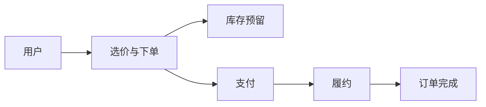
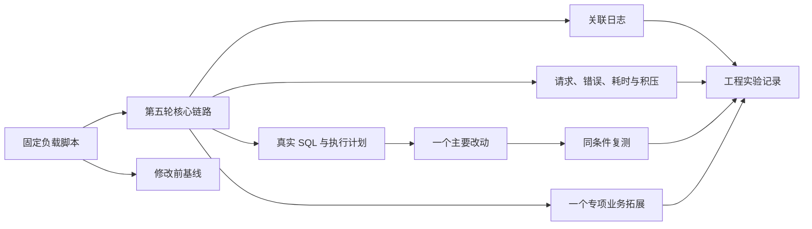

# learn-backend 第六轮考核：工程压测与专项拓展

> 本轮以第五轮完整交易链路为基础。你将建立可复现压测基线，定位并改进一个真实问题，再选择一个相邻业务方向完成小型拓展，用工程证据和最终答辩说明系统的正确性、性能与演进边界。

## 时间与内容量

本轮安排 8 周，建议每周投入 10～15 小时，总投入约 80～120 小时。前 5 周完成一条链路的测量、诊断和复测，后 2 周完成一个专项拓展，最后 1 周用于回归、复盘和答辩。压测与拓展共用第五轮项目，不另建演示工程。

建议节奏：

- 第 1 周：选择核心链路，固定环境、数据和成功判定；
- 第 2 周：编写负载脚本并采集基线；
- 第 3 周：定位一条真实 SQL 或资源等待问题；
- 第 4 周：实施一个主要改动并同条件复测；
- 第 5 周：用日志与指标复现、定位和确认恢复；
- 第 6～7 周：选择一个业务方向完成最小拓展；
- 第 8 周：运行全量回归，整理工程记录并完成最终答辩。

## 参考资料与 AI 学习方式

本轮继续采用“AI 辅助教学 + 官方文档核验”。AI 帮助拆分实验、阅读执行计划、收敛拓展范围和评审证据；性能结论来自当前项目的原始结果，业务结果由确定性代码与自动化测试证明。

- [提示词一：生成第六轮学习路线](prompts/round6/prompt1.md)
- [提示词二：建立可复现压测基线](prompts/round6/prompt2.md)
- [提示词三：诊断、优化并复测](prompts/round6/prompt3.md)
- [提示词四：选择并实现专项拓展](prompts/round6/prompt4.md)
- [提示词五：评审最终项目](prompts/round6/prompt5.md)

## 知识点总结

- **核心链路**：压测选择第五轮真实存在的用户操作，例如商品浏览或“选价—下单—库存预留”。脚本同时验证业务结果。
- **可复现基线**：固定机器、版本、数据、负载、预热和成功判定，保存修改前原始结果。
- **吞吐与尾延迟**：吞吐表示单位时间完成量，P95、P99 表示尾部等待；错误率与超时需要一起观察。
- **资源使用**：CPU、内存、连接池、数据库活动和消息积压帮助判断系统在计算、等待还是排队。
- **执行计划**：数据库执行计划展示查询访问路径、连接、排序和扫描情况，用于验证 SQL 原因假设。
- **控制变量**：一次实验只改变一个主要因素，并在相同条件下复测，才能建立改动与结果变化之间的证据。
- **结构化日志**：稳定字段连接请求、订单、支付、库存和履约步骤；敏感数据需要脱敏。
- **指标**：请求量、错误量、耗时和积压用于观察整体趋势；订单号等高基数值进入日志而非指标标签。
- **专项拓展**：拓展从现有业务边界继续生长，明确事实来源、状态、不变量和失败恢复。
- **架构决策**：重要改动记录背景、约束、候选方案、选择理由、代价和复查条件。

### Java 路线

- 使用当前 Spring Boot 项目提供的日志、指标和数据库诊断能力；
- 使用当前数据访问方案查看实际 SQL 和连接行为；
- 使用成熟负载工具驱动第五轮已存在的 HTTP 接口；
- 延续现有模块、事务和事件能力实现一个专项拓展；
- 使用现有测试框架验证优化前后业务语义和拓展不变量。

### Go 路线

## 项目链路变化

### 第六轮开始时

第五轮项目已经覆盖用户、商品、购物车、订单、活动、选价、支付、仓库基础和履约，但缺少可重复的容量数据，也未深入相邻业务方向。

### 第六轮完成后

固定负载脚本、日志、指标和执行计划共同形成工程证据；系统在此基础上增加一个有明确边界的小型业务拓展。

## 压测场景

从第五轮项目中选择一条真实链路：

- 分页浏览商品并读取当前活动价；
- 查看商品详情、SKU、库存提示和价格组成；
- 查询订单、支付和履约状态；
- 在隔离数据上执行“选价—下单—库存预留”；
- 在隔离数据上模拟支付通知或订单已支付事件。

默认场景为“分页浏览商品并读取当前活动价”。写链路压测需要准备独立用户、库存和业务标识，并验证最终订单、库存和支付结果。

## 工程任务

### 第一阶段：建立基线

- 写清业务操作、测试数据和成功判定；
- 记录机器、组件版本、部署方式和资源限制；
- 编写可重复执行的负载脚本；
- 通过小规模运行确认脚本执行真实业务；
- 保存吞吐、P95、P99、错误率和主要资源使用；
- 正式场景至少重复运行三次，记录样本数与波动。

先使用[压测基线提示词](prompts/round6/prompt2.md)固定条件。不同机器或不同数据规模的结果分开记录。

### 第二阶段：诊断一个真实问题

- 从压测、慢查询、日志或指标中选择一个具体问题；
- 保存问题发生时的原始结果、SQL、执行计划或资源等待证据；
- 建立最多三个原因假设，并设计能够区分结果的实验；
- 比较至少两个方案以及保持现状；
- 实施一个主要改动，记录读取、写入、存储、复杂度和并发代价；
- 验证业务结果与关键不变量保持一致。

问题可以是扫描过多、N+1、分页、索引不匹配、连接池等待、序列化开销或消息积压。缓存和扩容只有在证据对应时才作为方案。

### 第三阶段：建立定位闭环

- 为所选链路保留可关联的结构化日志；
- 增加请求量、错误量、耗时和必要积压等少量指标；
- 构造一次慢查询、超时、连接耗尽或消息处理失败；
- 从用户现象出发，通过日志和指标定位具体环节；
- 恢复后确认错误、耗时或积压信号回到正常范围；
- 记录时间线、影响、根因、促成因素和具体改进项。

### 第四阶段：同条件复测

- 使用与基线相同的环境、数据、负载、预热和成功判定；
- 复测次数与基线一致；
- 同时报告改善、退化、波动和仍未解决的问题；
- 保留原始结果和改动前后的执行计划；
- 运行第五轮业务不变量与全链路回归测试。

先使用[诊断与复测提示词](prompts/round6/prompt3.md)区分事实、假设、实验和结论。

## 专项拓展

以下方向选择一项，只完成一个最小闭环：

1. **售后与退款**：一种退款申请、金额上限、Mock 退款结果、重复通知和订单关联；
2. **复杂营销**：增加第二种优惠规则，明确候选活动、互斥或叠加、计算顺序和舍入；
3. **多仓策略**：增加第二个仓库，按库存可用性选择仓库，记录策略输入与结果；
4. **搜索**：为当前商品目录增加搜索，说明商品事实、派生索引、更新延迟和重建；
5. **风险控制**：针对重复下单、异常频率或优惠滥用实现一组确定性规则与处置记录；
6. **Agent 辅助能力**：通过公开后端接口完成商品或订单查询，覆盖权限、参数校验、调用限制、提示注入和模型不可用降级。

每个方向都需要：

- 明确用户、触发条件、成功和失败结果；
- 说明数据所有权、状态和业务不变量；
- 复用第五轮公开模块能力；
- 处理重复请求和一个故障恢复场景；
- 提供自动化测试与一条架构决策记录。

先使用[专项拓展提示词](prompts/round6/prompt4.md)把范围压缩到两周可实现的主流程。

## 验收标准

1. 压测链路来自第五轮真实业务，脚本可以重复运行；
2. 基线包含环境、数据、负载、预热、成功判定、至少三次结果和原始文件；
3. 至少一个真实问题有观察证据、原因假设和对照实验；
4. 改动方案与当前证据对应，并记录备选方案和主要代价；
5. 复测与基线条件一致，业务结果和不变量没有改变；
6. 日志与指标能够完成一次“现象—位置—原因—恢复”的演示；
7. 指标标签数量可控，日志不泄露凭据或完整个人信息；
8. 只选择一个专项方向，并完成一条可运行主流程；
9. 拓展的数据归属、状态、不变量和失败恢复可以说明；
10. 第五轮完整交易链路与拓展功能均有自动化回归证据；
11. README 可以指导验收者从空环境启动、压测、复测和演示拓展；
12. 最终答辩能够说明性能结论的适用环境与业务设计的已知限制。

## 工程实验记录模板

| 项目 | 需要回答的问题 |
| --- | --- |
| 问题 | 观察到什么现象，影响哪条业务链路？ |
| 环境 | 机器、版本、资源限制和数据规模是什么？ |
| 基线 | 如何复现，三次结果和波动如何？ |
| 假设 | 哪项证据指向什么原因，还有什么其他解释？ |
| 实验 | 只改变了哪个主要因素，预期看到什么？ |
| 结果 | 原始结果、日志、指标或执行计划显示了什么？ |
| 决定 | 选择哪个方案，放弃哪些方案，代价是什么？ |
| 复测 | 相同条件下改善、退化和未解决项分别是什么？ |

## 测试要求

至少验证：

- 小规模负载下请求和业务结果均正确；
- 正式基线与复测均可按文档重复三次；
- 优化前后查询结果、排序或交易不变量一致；
- 所选异常能够触发并在恢复后消失；
- 专项拓展的成功、校验失败、权限、重复请求和恢复；
- 日志敏感信息和指标标签检查；
- 第二至第五轮主要回归测试。

## 提交内容

- 完整源代码、依赖声明和数据库升级脚本；
- 负载脚本、测试数据准备与安全清理方式；
- 修改前后的原始结果、日志、指标查询和执行计划；
- 工程实验记录与架构决策记录；
- 专项拓展的需求、状态图、测试和演示步骤；
- 完整回归测试及运行结果；
- 项目 README、模块图与最终答辩材料；
- 能体现基线、诊断、改动、复测和拓展的 Git 记录。

## Bonus

完成必做内容后，可以选择一个方向：

1. 为同一链路增加一条基于基线的告警规则并演示触发和恢复；
2. 比较不同数据规模或冷热状态下的结果；
3. 将稳定的小规模性能检查加入持续集成；
4. 为专项拓展增加对账任务或另一条失败恢复路径。

## 提示

- 错误请求带来的高吞吐不构成有效性能结果；
- 压测端可能先达到资源上限，需要与服务端分开观察；
- P95、P99、错误率和资源使用需要一起解释；
- 一次修改多个参数会削弱因果判断；
- 拓展方向只完成一条主流程，复杂度留给后续项目实践；
- 搜索索引、统计结果和 Agent 回复属于派生结果，不替代业务事实；
- 所有性能数字注明适用环境，不作为跨机器排名。

## 官方资料入口

- [Grafana k6 文档](https://grafana.com/docs/k6/latest/)
- [MySQL 8.4 EXPLAIN](https://dev.mysql.com/doc/refman/8.4/en/explain.html)
- [PostgreSQL Using EXPLAIN](https://www.postgresql.org/docs/current/using-explain.html)
- [OpenTelemetry Signals](https://opentelemetry.io/docs/concepts/signals/)
- [Prometheus Metric and Label Naming](https://prometheus.io/docs/practices/naming/)

使用其他数据库、负载工具或观测组件时，请补充对应版本的一手官方资料。
